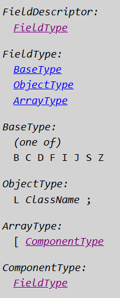
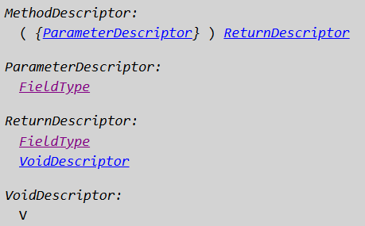
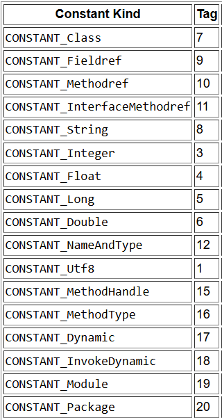

`https://docs.oracle.com/javase/specs/jvms/se11/html/jvms-4.html`

# .class

Compiled code to be executed by the Java Virtual Machine is represented using a hardware- and operating system-independent binary format, typically (but not necessarily) stored in a file, known as the `class` file format. The `class` file format precisely defines the representation of a class or interface, including details such as byte ordering that might be taken for granted in a platform-specific object file format.

Each `class` file contains the definition of a single class, interface, or module.

## The ClassFile Structure

```java
ClassFile {
    u4             magic;
    u2             minor_version;
    u2             major_version;
    u2             constant_pool_count;
    cp_info        constant_pool[constant_pool_count-1];
    u2             access_flags;
    u2             this_class;
    u2             super_class;
    u2             interfaces_count;
    u2             interfaces[interfaces_count];
    u2             fields_count;
    field_info     fields[fields_count];
    u2             methods_count;
    method_info    methods[methods_count];
    u2             attributes_count;
    attribute_info attributes[attributes_count];
}
```

## Descriptors

A *descriptor* is a string representing the type of a field or method.

## Field Descriptor

A *field descriptor* represents the type of a class, instance, or local variable.



# Method Descriptor



`Object m(int i, double d, Thread t) {...}` --> `(IDLjava/lang/Thread;)Ljava/lang/Object;`

## Constant Pool

Java Virtual Machine instructions do not rely on the run-time layout of classes, interfaces, class instances, or arrays. Instead, instructions refer to symbolic information in the `constant_pool` table.

All `constant_pool` table entries have the following general format:

```java
cp_info {
    u1 tag;
    u1 info[];
}
```


